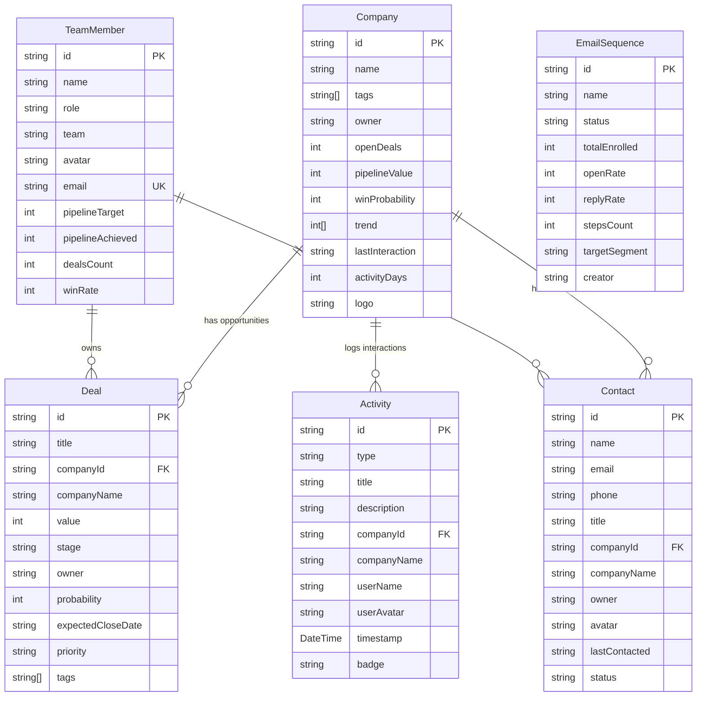

# Database Model & Entity-Relationship Considerations

## 1. Schema Specifications

All models are defined in [`prisma/schema.prisma`](file:///c:/ai/sales-crm/prisma/schema.prisma).

---

## 2. Technical Decisions & Trade-offs

### A. Flexible Foreign Keys vs Strict Constraints
- **Consideration**: During initial prototyping, initial seed datasets may reference companies with arbitrary slug formats.
- **Decision**: Keep foreign references (`companyId`) indexed and linked logically, while avoiding cascade blocking on mock seed imports. When moving into strict production constraints, foreign key constraints (`@relation(fields: [companyId], references: [id])`) can be enforced with database migration guards.

### B. Array Types in PostgreSQL
- **Decision**: Used native PostgreSQL array types (`String[]`, `Int[]`) for:
  - `tags` (Company and Deal tags)
  - `trend` (Sparkline trend arrays for ARR velocity)
- **Benefit**: Eliminates the overhead of separate join tables for simple, fixed-cardinality tag arrays while preserving native SQL queryability.

### C. Seeding Strategy
- **File**: [`prisma/seed.ts`](file:///c:/ai/sales-crm/prisma/seed.ts)
- **Execution**: `npx tsx prisma/seed.ts`
- **Behavior**:
  - Drops existing data safely to avoid unique constraint collisions.
  - Inserts companies, deals, contacts, activities, sequences, and team members in sequential batches.
  - Generates realistic enterprise CRM data (Microsoft, Apple, Google, NVIDIA, etc.).
